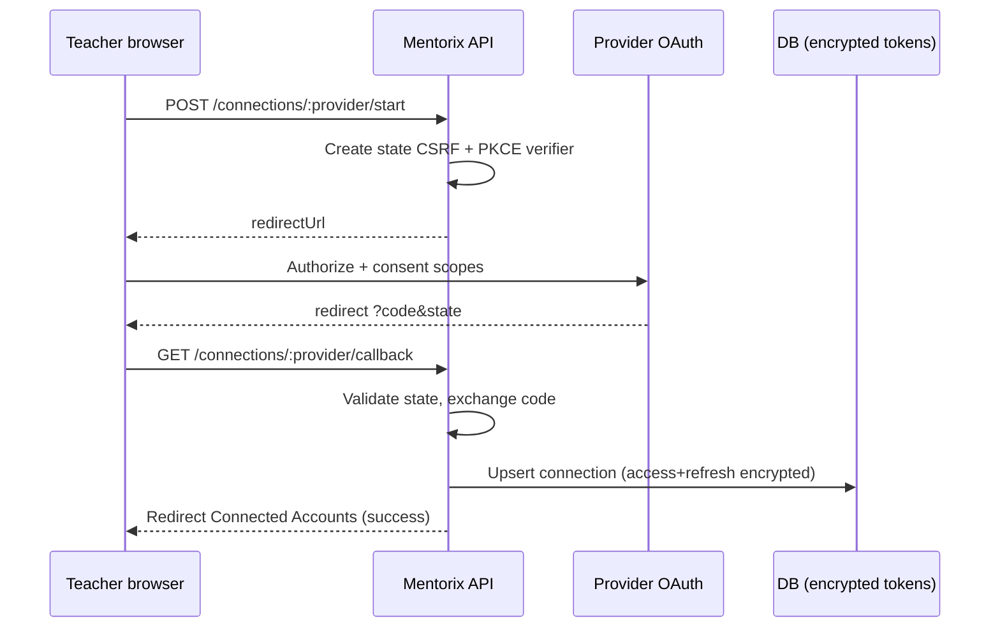
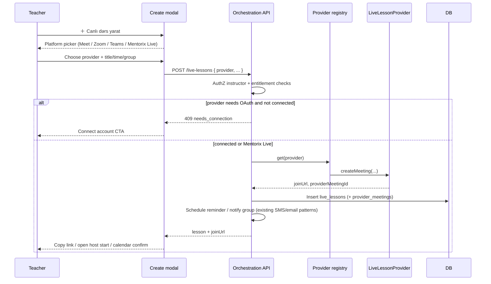

# Live Lesson Providers Architecture

**Status:** Phase 1 — Google Meet implemented (OAuth + Calendar Meet create + lesson bind)  
**Date:** 2026-09-14 (Phase 0 doc); Phase 1 code 2026-09-14  
**Audience:** product + engineering

---

## 1. Product intent (non-negotiable)

1. **Mentorix never pays** Zoom / Google / Microsoft monthly licenses for teachers. There is no “Premium includes Zoom Pro”.
2. Mentorix is an **orchestration hub**: create lesson → pick platform → create meeting on the **teacher’s** connected account → invite → store link → remind → attendance hooks → calendar → post-lesson assignment → AI grade → payment tracking.
3. **Video runs on the teacher’s account**:
   - **Google Meet** — teacher connects Google → Mentorix creates Meet → link binds to lesson
   - **Zoom** — teacher connects Zoom → meeting on their account; Basic **40-min group** limit is Zoom’s rule
   - **Teams** — teacher connects Microsoft → meeting on their account; Free/consumer limits are Microsoft’s rule
4. Package copy **“Canlı dərslər — limitsiz”** means unlimited **Mentorix management of lessons**, not Mentorix-owned unlimited video infrastructure for third-party providers. Do not invent “100 live lessons” caps unless product later requires them.
5. UX entry: **「＋ Canlı dərs yarat」** → simple platform picker (Meet / Zoom / Teams [/ Mentorix Live]), not a huge wizard on first screen.
6. Code shape: `LiveLessonProvider` abstraction → `GoogleMeetProvider` / `ZoomProvider` / `TeamsProvider` (/ `MentorixLiveProvider`). **No** `if (google|zoom|teams)` spaghetti in controllers.

---

## 2. Current state audit (what exists today)

### 2.1 Verdict

**Live video today is first-party “Mentorix Live” on LiveKit (WebRTC).**  
Join links are Mentorix URLs (`/live/:roomCode`, `/live/join/:token`). There is **no** Zoom / Meet / Teams / Microsoft Graph integration and **no** marketing that claims Mentorix supplies Zoom Pro.

### 2.2 Product surface

| Area | Location / behavior |
|------|---------------------|
| Instructor hub | `/instructor/live/history` — create/schedule rooms, guest links, history, recordings |
| In-call | `/live/:roomCode` — LiveKit room UI |
| Guest join | `/live/join/:token` |
| Recording share | `/lr/:shareToken` |
| Group start | Teaching groups → start canlı dərs + optional SMS/email |
| API | `/api/live` (+ public guest/recording routes) |

### 2.3 Stack highlights

- **Backend:** `liveRoomService`, guest/admission/media/recording/presentation/chat services; LiveKit tokens via `livekit-server-sdk`
- **Frontend:** `livekit-client`, `@livekit/components-react`; local screen recording (`MediaRecorder`) then upload
- **DB:** `live_rooms`, `live_sessions`, `live_recordings`, guest/admission/chat/poll tables; plan columns for recording quotas
- **Plan gates:** concurrent **participants** + **recording** hours/storage — **lesson count is already unlimited** on all plans (`livePlanLimits`, migration `196`)
- **OAuth today:** Google used for **sign-in only** (`google-auth-library`). No teacher “connected accounts” store for Calendar/Meet/Zoom/Teams
- **Attendance / calendar:** enrollment attendance exists separately; **not** wired to `live_sessions`. No external calendar product
- **Legacy:** `jitsi_room` still appears in some API payloads; **no Jitsi client** remains

### 2.4 How a lesson works today

```text
Instructor creates Mentorix Live room
  → students get {APP_URL}/live/{MX-XXXXXX}
  → backend issues LiveKit AccessToken
  → frontend connects to LIVEKIT_WS_URL
  → optional local recording upload + plan quota
```

### 2.5 Marketing / pricing copy (risk)

| Finding | Detail |
|---------|--------|
| Zoom Pro claim? | **None.** Zoom appears only as competitive copy (“no hopping between Zoom, Forms, Excel…”) |
| “Limitsiz canlı dərslər” | Markets **unlimited Mentorix Live session count**, with participant caps (5 / 20 / 50 / unlimited) |
| Implication | Copy is accurate for LiveKit today, but when BYO Meet/Zoom/Teams ship, wording should clarify **management** vs **Mentorix-hosted video** |

**Phase 0 decision:** no marketing PR required solely for Zoom Pro (nothing falsely claims it). Copy clarifications are recommended at Phase 1 launch (see §10).

### 2.6 What multi-provider sits beside vs replaces

| Keep / sit beside | Extend / new | Do not force onto external providers |
|-------------------|--------------|--------------------------------------|
| Mentorix Live (LiveKit) as one provider | Provider enum + external meeting rows | Waiting-room / LiveKit mute / in-call polls |
| SMS/email “lesson started” templates | Swap join URL for external `join_url` | Local `.webm` recording quotas as-is |
| Instructor Live History as hub | List external meetings + LiveKit rooms | LiveKit RoomService media control |
| Enrollment attendance (later hook) | Optional “mark attended when meeting ended” | Assuming Zoom cloud recording = Mentorix storage |

**Recommendation:** treat **Mentorix Live** as `MentorixLiveProvider` implementing the same interface. External providers are peers, not a rewrite of LiveKit.

---

## 3. API / OAuth feasibility

### 3.1 Summary matrix

| Provider | Can Mentorix create meetings **without** buying per-teacher Pro? | Teacher account requirement | Free-tier meeting duration (provider rule) | Recommended app type |
|----------|------------------------------------------------------------------|-----------------------------|--------------------------------------------|----------------------|
| **Google Meet** | **Yes** — uses teacher’s Google account | Personal or Workspace Google | Meet free limits apply to teacher’s Google/Workspace plan (not billed by Mentorix) | OAuth web app; Calendar events + Meet **or** Meet REST spaces |
| **Zoom** | **Yes** — User OAuth creates meetings as that host | Zoom account (Basic OK for create) | **~40 min group** meetings on Basic; 1:1 often longer; participant caps on Basic | **User-managed OAuth** app (not Account-level “we host all meetings”) |
| **Microsoft Teams** | **Yes for work/school** — delegated Graph | **Work or school** account with Teams | Consumer/free Teams meeting limits are Microsoft’s; Graph **does not support personal MSA** for `onlineMeetings` | Multi-tenant Entra app; **delegated** `OnlineMeetings.ReadWrite` |

**Cost model:** Mentorix pays only for **its own** app registrations, hosting, and LiveKit. Teachers bring their own Meet/Zoom/Teams entitlements.

### 3.2 Google Meet

**Two viable create paths:**

1. **Calendar API v3** (proven): `events.insert` with `conferenceDataVersion=1` and `conferenceData.createRequest` (`hangoutsMeet`). Returns Meet link on the event (`hangoutLink` / `conferenceData.entryPoints`).
2. **Meet REST API**: `spaces.create` with scope `meetings.space.created` (sensitive; Google verification may apply for production).

**Recommended Phase 1 path:** Calendar API — creates calendar event + Meet in one flow (aligns with “reminder + calendar” product goals).

| Item | Recommendation |
|------|----------------|
| Scopes (narrow) | `https://www.googleapis.com/auth/calendar.events` (+ `openid` / `email` / `profile` for account identity) |
| Optional later | Meet REST for participant/artifact reads; Drive readonly for recordings is **restricted** — avoid early |
| App type | Google Cloud OAuth client (Web) + consent screen |
| Tokens | Authorization code + refresh; store encrypted server-side; refresh offline |
| Rate limits | Standard Google Workspace quotas; one event per lesson is fine |
| Verification | `calendar.events` is sensitive → plan OAuth verification before broad production |
| Separability | **Do not** reuse Google **login** ID token flow for Calendar scopes — separate “Connect Google for Meet” with incremental authorization |

### 3.3 Zoom

| Item | Recommendation |
|------|----------------|
| App type | **OAuth** app on Zoom Marketplace, **user-level** (act as the connecting teacher) |
| Create API | `POST /users/me/meetings` |
| Scopes (granular) | `meeting:write:meeting`, `meeting:read:meeting` (add delete/update as needed); avoid admin scopes |
| Tokens | Access ~1h; refresh with rotation (always persist **latest** refresh token); refresh expiry ~90 days → UX to reconnect |
| Rate limits | Create/update ~**100 meetings / user / day** (account-agnostic) |
| Basic plan | API create works; **group meetings ~40 minutes**; participant limits remain Zoom’s |
| Mentorix Pro? | **Not required.** Paying Zoom Pro for every teacher would violate business rule #1 |
| Marketplace | Publish/review needed for production multi-tenant use |

### 3.4 Microsoft Teams (Graph)

| Item | Recommendation |
|------|----------------|
| API | `POST /me/onlineMeetings` (Cloud Communications) **or** Calendar event with `isOnlineMeeting` |
| Permission | Delegated: `OnlineMeetings.ReadWrite` (+ `offline_access`, `User.Read`) |
| **Blocker** | **Personal Microsoft accounts are not supported** for `onlineMeetings`. Teachers need **work/school** Entra ID + Teams |
| App-only | `OnlineMeetings.ReadWrite.All` needs tenant admin **application access policy** — wrong for multi-tenant “each teacher connects” SaaS; prefer **delegated** |
| Free limits | Meeting length / participant caps follow the teacher’s Microsoft/Teams SKU — Mentorix does not buy licenses |
| AZ market note | Many independent tutors may only have personal Outlook/Hotmail → Teams phase may have **lower attach rate**; surface clear UX copy |

### 3.5 Feasibility conclusion

- **Meet + Zoom:** feasible as BYO OAuth without Mentorix buying Pro seats.
- **Teams:** feasible only for teachers with organizational Microsoft accounts; ship later or with explicit eligibility messaging.
- **Mentorix Live:** remains the zero-extra-account path and the only path where Mentorix controls media/recording quotas.

---

## 4. Architecture

### 4.1 Module layout (proposed)

```text
backend/src/
  providers/liveLesson/
    LiveLessonProvider.js          # interface / contract
    registry.js                    # provider id → implementation
    MentorixLiveProvider.js        # wraps existing liveRoomService
    GoogleMeetProvider.js          # Phase 1
    ZoomProvider.js                # Phase 2
    TeamsProvider.js               # Phase 3
  services/
    teacherProviderConnectionService.js  # connect/disconnect, token CRUD
    liveLessonOrchestrationService.js    # create lesson: pick provider → createMeeting → persist
  controllers/
    teacherConnectionsController.js
    liveLessonController.js        # thin; no provider if-else
  routes/
    teacherConnections.js
    liveLessons.js                 # or extend /live carefully
  lib/
    tokenCrypto.js                 # AES-GCM encrypt/decrypt at rest
```

Frontend (later):

```text
frontend/src/
  pages/instructor/LiveHistory.jsx     # hub; “＋ Canlı dərs yarat”
  components/live/CreateLiveLessonModal.jsx  # platform picker first
  pages/instructor/ConnectedAccounts.jsx     # connect Meet/Zoom/Teams
```

### 4.2 Provider interface (contract)

```js
/**
 * @typedef {object} CreateMeetingInput
 * @property {string} instructorId
 * @property {string} title
 * @property {string} [scheduledAt] ISO
 * @property {number} [durationMinutes]
 * @property {string[]} [attendeeEmails]
 * @property {object} [metadata] groupId, packageId, etc.
 *
 * @typedef {object} CreateMeetingResult
 * @property {string} providerMeetingId
 * @property {string} joinUrl
 * @property {string} [startUrl] host start (Zoom)
 * @property {string} [passcode]
 * @property {object} [raw] provider payload subset (no secrets)
 */

class LiveLessonProvider {
  get id() { /* 'mentorix_live' | 'google_meet' | 'zoom' | 'teams' */ }
  async isConnected(instructorId) {}
  async createMeeting(instructorId, input) {}
  async updateMeeting(instructorId, providerMeetingId, patch) {}
  async cancelMeeting(instructorId, providerMeetingId) {}
  async getMeeting(instructorId, providerMeetingId) {}
  // Optional Phase N+:
  // async fetchAttendance(instructorId, providerMeetingId) {}
}
```

Controllers call `registry.get(providerId).createMeeting(...)` only.

### 4.3 OAuth connect / disconnect flows

#### Shared pattern



- **CSRF:** opaque `state` bound to `instructor_id` + TTL (Redis or signed cookie)
- **PKCE:** required for Google/Microsoft best practice; Zoom as supported
- **Disconnect:** revoke at provider when API exists + delete local tokens; soft-fail revoke
- **Frontend never** receives refresh tokens — only connection status (`connected`, `email`, `expires_at`, `needs_reauth`)

#### Per provider

| Provider | Authorize | Token store keys | Disconnect |
|----------|-----------|------------------|------------|
| Google | Google OAuth 2 + Calendar scopes | `google_meet` | revoke token + delete row |
| Zoom | Zoom OAuth authorize | `zoom` | Zoom revoke + delete |
| Microsoft | Entra authorize (common/organizations) | `teams` | revoke + delete; reject personal accounts early |

---

## 5. Lesson create sequence



**Controller rule:** orchestration service owns branching; HTTP layer stays thin.

---

## 6. Database changes (proposed)

> Names illustrative; migrations in Phase 1+. Prefer additive schema; keep existing `live_*` tables for Mentorix Live.

### 6.1 `teacher_provider_connections`

| Column | Type | Notes |
|--------|------|-------|
| `id` | uuid/bigserial | PK |
| `instructor_id` | FK users | |
| `provider` | enum/text | `google_meet`, `zoom`, `teams` |
| `provider_account_id` | text | stable external subject |
| `account_email` | text | display only |
| `access_token_enc` | bytea/text | AES-GCM ciphertext |
| `refresh_token_enc` | bytea/text | never null-able leak to API |
| `token_expires_at` | timestamptz | access token |
| `scopes` | text[] / jsonb | granted scopes |
| `status` | text | `active`, `needs_reauth`, `revoked` |
| `meta` | jsonb | non-secret (tenant id, etc.) |
| `created_at` / `updated_at` | timestamptz | |
| UNIQUE | `(instructor_id, provider)` | one connection per provider |

### 6.2 `live_lessons` (orchestration row) — or extend `live_rooms`

**Option A (cleaner long-term):** new `live_lessons` hub table; `live_rooms` becomes Mentorix Live-specific detail.

**Option B (faster Phase 1):** add columns to `live_rooms`:

| Column | Notes |
|--------|-------|
| `provider` | default `mentorix_live` |
| `provider_meeting_id` | external id / event id |
| `join_url` | external Meet/Zoom/Teams URL (null for LiveKit — use app route) |
| `start_url` | Zoom host start (server-only or short-lived fetch) |
| `passcode` | optional |
| `provider_payload` | jsonb sanitized |
| `connection_id` | FK to connections (nullable for LiveKit) |

### 6.3 Attendance / calendar hooks (later)

- Optional `live_lesson_attendance_events` (provider webhook / poll)
- Do **not** auto-mutate enrollment attendance in Phase 1 without product sign-off
- Calendar: Google path already creates Calendar event; Zoom/Teams may create ICS or rely on provider calendar

### 6.4 Token encryption

- Env: `PROVIDER_TOKEN_ENCRYPTION_KEY` (32-byte, separate from `JWT_SECRET`)
- Algorithm: AES-256-GCM; store `iv + tag + ciphertext`
- Rotation: support key version prefix (`v1:`)
- No plaintext tokens in logs; redact provider responses

---

## 7. Security

| Control | Requirement |
|---------|-------------|
| Token exposure | Refresh/access tokens **server-only**; FE gets connection status |
| Encryption at rest | Required for all OAuth tokens |
| CSRF | OAuth `state` (+ PKCE) |
| Account linking | Bind callback to logged-in instructor session; reject mismatched `state` |
| Least privilege | Narrow scopes; no Zoom/Microsoft admin scopes for BYO |
| Secret start URLs | Zoom `start_url` is privileged — do not put in public student payloads; host-only endpoint |
| SSRF / open redirect | Allowlist OAuth redirect URIs |
| Webhooks (Phase N) | Verify Zoom/Graph signatures; idempotent handlers |
| Soft delete | On disconnect, wipe ciphertext; keep audit of “was connected” if needed without secrets |
| Separated Google flows | Login ≠ Calendar connect (different clients/scopes OK) |

---

## 8. UX wireflow — 「＋ Canlı dərs yarat」

### Screen 1 — Platform picker (required first)

```text
┌─────────────────────────────────────────┐
│  Canlı dərs yarat                       │
│  Platform seçin                         │
│                                         │
│  [ Google Meet ]  [ Zoom ]  [ Teams ]   │
│  [ Mentorix Live ]                      │
│                                         │
│  (kiçik hint: video müəllimin           │
│   öz hesabında keçirilir)               │
└─────────────────────────────────────────┘
```

Not a multi-step wizard before choice.

### Screen 2 — Details (after pick)

- Title, schedule (now / later), optional group, notify SMS/email
- If provider disconnected → inline **“Hesabı bağla”** before create
- Duration hint for Zoom Basic / Teams free (honest, not a Mentorix upsell)

### Connected Accounts (settings)

- Cards: Google Meet / Zoom / Teams — Connect | Disconnect | Reconnect
- Teams: “İş və ya məktəb Microsoft hesabı tələb olunur”

### Student experience

- Email/SMS/in-app: **provider join link** (or Mentorix Live route)
- Mentorix still owns lesson record, reminders, post-lesson assignment entry points

---

## 9. Package / pricing copy recommendations

| Today | Recommendation when BYO ships |
|-------|-------------------------------|
| `Limitsiz canlı dərslər · N iştirakçı` | Keep **limitsiz** = unlimited **lesson management / scheduling** |
| Participant lines | Clarify they apply to **Mentorix Live** (LiveKit), not Zoom/Meet participant caps |
| Competitive Zoom line | Keep as “all-in-one workflow”; avoid sounding like Zoom reseller |
| Never add | “Premium-ə Zoom Pro daxildir”, “Limitsiz Zoom”, “Mentorix video infrastrukturu ödəyir” |
| Optional microcopy | “Meet / Zoom / Teams — müəllimin öz hesabı · Mentorix Live — platforma otağı” |

**Phase 0:** no mandatory copy PR (no false Zoom Pro claim found). Implement clarifications with Phase 1 UI.

---

## 10. Phased rollout

| Phase | Scope | Exit criteria |
|-------|--------|---------------|
| **0 — Docs (this)** | Architecture, feasibility, schema, security, UX | Team approval |
| **1 — Google Meet** | Connections + Calendar Meet create + bind lesson + invite/remind | Teacher can create Meet-backed lesson without LiveKit |
| **2 — Zoom** | User OAuth + create meeting + store join/start + Basic-limit UX copy | Same for Zoom; Marketplace app submitted |
| **3 — Teams** | Delegated Graph + work/school gate + create onlineMeeting | Same for eligible Microsoft accounts |
| **4 — Hardening** | Webhooks attendance, reconnect UX, key rotation, observability | Production SLOs |

**Why Meet first:** Calendar+Meet aligns with reminders; OAuth familiar; personal Google common for tutors; lowest “wrong account type” rate vs Teams.  
**Zoom second:** high teacher demand; clear Basic 40-min messaging.  
**Teams last:** work/school-only API constraint.

**Non-goals (all phases unless revisited):**

- Mentorix purchasing Zoom Pro / Teams licenses
- Replacing Mentorix Live with only external video
- Full in-call feature parity (mute-all, polls) inside Zoom/Meet/Teams
- Restricted Google Drive recording download in Phase 1
- Inventing artificial “100 lessons/month” caps

---

## 11. Risks

| Risk | Mitigation |
|------|------------|
| OAuth verification delays (Google/Zoom Marketplace) | Start app registration in Phase 0/1; use test users |
| Zoom Basic 40-min surprise | Explicit UX + FAQ; never imply Mentorix removes limit |
| Teams personal accounts fail | Eligibility check + copy; don’t block Meet/Zoom |
| Token refresh rotation bugs (Zoom) | Always overwrite refresh token; `needs_reauth` status |
| LiveKit cost vs BYO | BYO reduces Mentorix media cost; keep Live as convenience path |
| Copy confusion (“limitsiz”) | §9 clarifications at Phase 1 |
| Scope creep (recording, attendance auto) | Keep Phase 1 to create + link + notify |

---

## 12. Cost model

| Cost bearer | What |
|-------------|------|
| **Mentorix** | App hosting, LiveKit for Mentorix Live, OAuth app registrations, engineering |
| **Teacher** | Their Google / Zoom / Microsoft meeting entitlements and duration limits |
| **Not Mentorix** | Per-seat Zoom Pro, Teams Phone, Meet hardware add-ons |

---

## 13. Implementation checklist

- [x] Approve this doc + provider order
- [ ] Register Google Cloud OAuth (Calendar events) test/production client — **REQUIRES USER ACTION**
- [ ] Register Zoom OAuth user-managed app (dev) — Phase 2
- [ ] Register Entra multi-tenant app (Teams) — Phase 3
- [x] Migration: `teacher_provider_connections` + lesson provider columns (`203_live_lesson_providers.sql`)
- [x] `tokenCrypto` + connection service
- [x] `LiveLessonProvider` + `MentorixLiveProvider` adapter around existing LiveKit
- [x] `GoogleMeetProvider` + create UX picker
- [x] Copy clarifications for Live vs BYO (picker + history microcopy)
- [ ] Zoom → Teams

### Phase 1 shipped (code)

| Area | Location |
|------|----------|
| Providers | `backend/src/providers/liveLesson/*` |
| OAuth + tokens | `teacherProviderConnectionService`, `googleMeetOAuth`, `tokenCrypto` |
| Orchestration | `liveLessonOrchestrationService` → extends `createLiveRoom` |
| HTTP | `/api/teacher-connections`, `/api/live-lessons`, `POST /api/live/create` with `provider` |
| UI | `CreateLiveLessonModal`, Live History CTA + connect/disconnect |
| Env | `GOOGLE_CLIENT_SECRET`, `GOOGLE_MEET_REDIRECT_URI`, `PROVIDER_TOKEN_ENCRYPTION_KEY` (+ optional `GOOGLE_MEET_CLIENT_*`) |

---

## 14. Explicit status

**Phase 1 Google Meet is implemented in code.** Production use still requires Google Cloud OAuth client setup (Calendar API + redirect URI + consent) and Railway env vars — see `backend/.env.example`.  
Next: Phase 2 Zoom.
